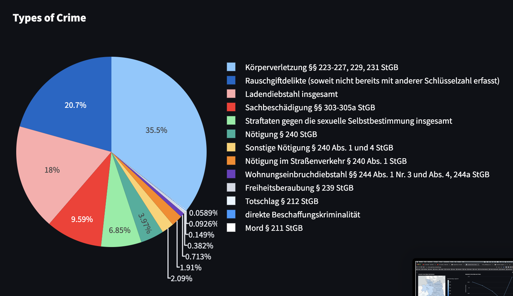

# Juvenile Crime in Germany
## Distribution and Frequency Development  
 

### This Capstone Project  
This capstone project is a collaborative work of <a href='https://www.linkedin.com/in/johanna-koepke/' target='_blank'>Johanna Köpke</a>, <a href='https://www.linkedin.com/in/julie-laur-a4167713a/' target='_blank'>Julie Laur</a> and me <a href='https://www.linkedin.com/in/alexander-schuppe/' target='_blank'>Alexander Schuppe</a>.  
You find the code for the data preparation, cleaning and analysis part on: <a href='https://github.com/JulieLaur/capstone_al_jo_ju' target='_blank'>https://github.com/JulieLaur/capstone_al_jo_ju</a>.  
The code for the dashboard is in this repo.  
If you want to try out the working dashboard, you can go to: <a href='https://crime-germany.streamlit.app/'>https://crime-germany.streamlit.app</a>  

### Structure of the app.py file  
---

__To your help:__  
When using and trying out the dashboard, the user instructions further down might help you.  

The _app.py_ file is the starting point of a Streamlit Dashboard. It runs - as a usual python file - top down.  

Every time the user interacts with some of the controls (e.g. sliders, buttons, etc.) on the sidebar to the left of the dashboard, the complete python script _app.py_ again runs top down. This makes it necessary to pay attention to the order in which you place different parts of the script.  

Certain elements that are big in size and heavy to load (e.g. large files or data from a database) can be cached so that they are only loaded once (if nothing in the data or the request itself changes). This is done with the _@st.cache_data_ decorator at the top of some functions.  

This also means that any information stored in variables is lost as soon as the script runs again after an user interaction. Information needed to survive can be stored inside of session variables (similar to PHP programming).  They are like global variables in python, 'survive' the rerun of the script and make it possible to transfer information betwenn different html pages.  

__Control Flow of the script:__  
1. As usual at first the needed python libraries are imported.  
2. Then some Streamlit internal configurations are made.  
3. A password protection for the Dashboard is implemented, so not everybody can use the Dashboard.  
4. Secret information (like password or database credentials) are stored and provided with a Streamlit intern mechanism via a so called _secrets.toml_ file (similar to the _.env_ file). This file is added to _.gitignore_ and not uploaded on GitHub.  
1.Then all the functions that are needed follow. Every Chart on the dashboard has it's own function to deliver the data needed to draw it, so that it is easier to react to user interactions.  
1. The first function _get_dataframe(query)_ connects to the postgres database on Azure, can run queries to the database and return pandas dataframes.  
2. All needed Dataframes are loaded at the beginning into the script. They are cached so that they will only be loaded once. One _.json_ file is loaded, containing the geospatial information about the federal states for the map charts.  
3. The needed session variables are created and initialized. They provide the starting state for all the controls in the sidebar (e.g. setting the _year_ to 2022).  
4. Some dictionaries are defined for translating complicated names and keys like column names in SQL databases to userfriendly names in the controls in the sidebar.  
5. The elements of the sidebar are created.  
6. Finally the elements of the dashboard are printed to the html page. The html file is divided and structured with the help of the two Streamlit elements _Tabs_ and _Columns_.  
 

### Overview  
---
This is the Dashboard for our capstone project in the Advanced Data Analyst Bootcamp of neuefische (may to august 2023).  
We are:  
- <a href='https://www.linkedin.com/in/johanna-koepke/' target='_blank'>Johanna Köpke</a>  
- <a href='https://www.linkedin.com/in/julie-laur-a4167713a/' target='_blank'>Julie Laur</a>  
- <a href='https://www.linkedin.com/in/alexander-schuppe/' target='_blank'>Alexander Schuppe</a>  

The Dashboard shows different statistics and gives insights about juvenile crime in Germany.  
 
### The Data  
---
The Data used for this Dashboard comes from:  
- <a href='https://www.bka.de/DE/AktuelleInformationen/StatistikenLagebilder/PolizeilicheKriminalstatistik/pks_node.html' target='_blank'>German Federal Criminal Police Office: PKS Bundeskriminalamt, 2018 - 2022, Version 2.0</a>  
- <a href='https://www.destatis.de/DE/Home/_inhalt.html' target='_blank'>German Federal Statistical Office: Statistisches Bundesamt (Destatis), 2023</a>  
   
### Technical Overview  
---
__Dashboard__  
The Dashboard is coded completely in Python with the <a href='https://streamlit.io/' target='_blank'>Streamlit</a> library. It is hosted with a free account  on the Streamlit-Server.  

__Database__  
It loads the needed data from several tables stored in a PostgreSQL-Database hosted on <a href='https://azure.microsoft.com/de-de/' target='_blank'>Microsoft Azure</a>.  

__Charts__  
The Charts are created with the Python <a href='https://plotly.com/' target='_blank'>Plotly</a> library.  
 
### User Instructions  
---
### __Sidebar__  
   
The Dashboard has several controls that are located in the sidebar on the left. The sidebar can be opened or hidden.  

### __Controls__  
The Dashboard has several controls you can use to actively change, what the charts are showing.  
You can change:  
- Year (choosing between 2018 to 2022),
- Federal State (choosing Germany as country or one of it's 16 federal states),
- Age Group (choosing between defined age groups that are relevant for german laws),  
- Crime Type (choosing between selected crime types that are relevant for Juveniles),  
- Gender (differentiating between female and male).
Beneath the map you find another control to change between absolute and relative values.  
The Reset-Button resets all values to their starting point.

Not all charts are reacting to all controls. E.g. the map always shows all 16 federal states (no matter which state you choose).

__Map__  
The map on the top left is showing crime distribution over whole Germany.  
  
 

__Barchart__  
The bar chart on the top right is showing the top 3 crimes committed in the selected federal state.  

__Piechart__  
The pie chart underneath is showing the distribution of selected types of crime that are relevant for Juveniles.  
  

__Overview of Years__
The overview is showing the growth rates from one year to the next, on the left the absolute numbers, on the right the relative numbers calculated for 100.000 inhabitants.  

__Linecharts__  
The line charts on the bottom are showing the absolute and relative crime rate over years.  
  
 

